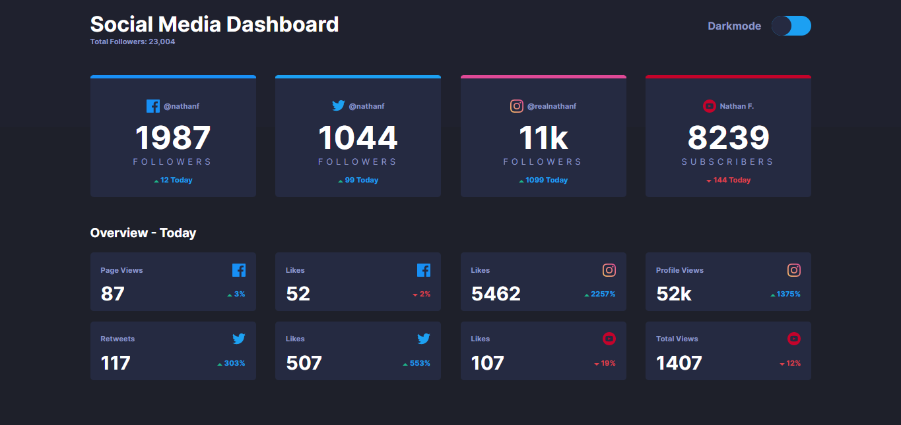
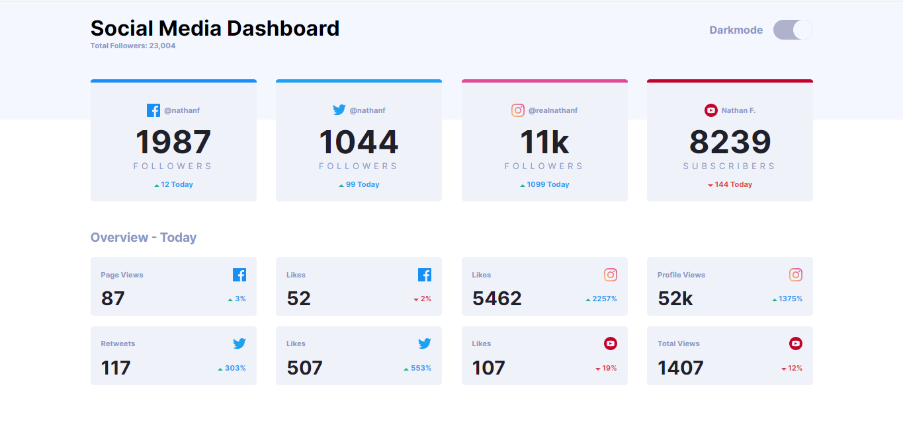

# Frontend Mentor - Social media dashboard with theme switcher solution

This is a solution to the [Social media dashboard with theme switcher challenge on Frontend Mentor](https://www.frontendmentor.io/challenges/social-media-dashboard-with-theme-switcher-6oY8ozp_H). Frontend Mentor challenges help you improve your coding skills by building realistic projects. 

## Table of contents

- [Overview](#overview)
  - [The challenge](#the-challenge)
  - [Screenshot](#screenshot)
  - [Links](#links)
- [My process](#my-process)
  - [Built with](#built-with)
  - [What I learned](#what-i-learned)
  - [Continued development](#continued-development)
- [Author](#author)
- [Acknowledgments](#acknowledgments)

**Note: Delete this note and update the table of contents based on what sections you keep.**

## Overview

### The challenge

Users should be able to:

- View the optimal layout for the site depending on their device's screen size
- See hover states for all interactive elements on the page
- Toggle color theme to their preference

### Screenshot





### Links

- Solution URL: [https://github.com/Khemmie-Ray/Social-media-dashboard-with-theme-toggle.git](https://github.com/Khemmie-Ray/Social-media-dashboard-with-theme-toggle.git)
- Live Site URL: [https://social-media-dashboard-theme-mode.netlify.app/](https://social-media-dashboard-theme-mode.netlify.app/)

## My process

### Built with

- Semantic HTML5 markup
- Flexbox
- Mobile-first workflow
- [React](https://reactjs.org/) - JS library


### What I learned

One of the major things i learnt with this project had to do with the passing of props, destructuring it and also changing the mode state of the page.

```html
const {arrow, rate, title, social, figure, lightMode} = props
    const valClass = lightMode == true ? "light mini-card" : "mini-card"
  
    return (
        <div className={valClass}>
            <div className="box-one">
                <p className="views">{title}</p>
                
            </div>...
```

### Continued development

I intend to build more react projects further exploring react concepts such as hooks, router, useEffect etc.

## Author

- Frontend Mentor - [@Khemmie-Ray](https://www.frontendmentor.io/profile/Khemmie-Ray)

## Acknowledgments

I will like to say thank you to @ichbinkator for helping me debug some errors I had while working on this project.